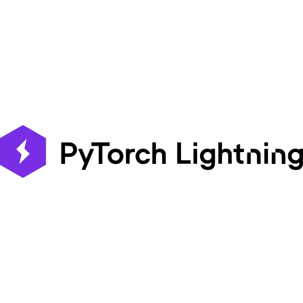

<div align="left">
    
    <div style="display: inline-block;">
        <h2 style="display: inline-block; vertical-align: middle; margin-top: 0;">LIGHTNING-PRACTICE</h2>
        <p>
	<em>Эталонное решение практики</em>
</p>
        <p>
	
	
</p>
        <p>Built with the tools and technologies:</p>
        <p>
	
	
	
</p>
    </div>
</div>
<br clear="left"/>

## Содержание

- [Обзор](#-обзор)
- [Структура проекта](#-структура-проекта)
- [Запуск проекта](#-запуск-проекта)
  - [Необходимые инструменты](#-необходимые-инструменты)
  - [Установка зависимостей](#-установка-зависимостей)
  - [Тестирование](#-тестирование)

## Обзор

Данный проект является эталонным решением практики на [Stepik]("https://stepik.org/lesson/1466624/step/15?unit=1486235").
Если вы нашли какой-то недочет в проекте - нашите в группу курса 😊


## Структура проекта

```sh
└── Lightning-Practice/
    ├── data
    │   ├── sign_mnist_test.csv
    │   └── sign_mnist_train.csv
    ├── pyproject.toml
    ├── src
    │   ├── convnet.py
    │   ├── datamodule.py
    │   ├── dataset.py
    │   ├── main.py
    │   └── trainer.py
    └── uv.lock
```

## Запуск проекта

### Необходимые инструменты

Чтобы запустить этот проект вам понадобится установленный `Python`

### Установка зависимостей

Чтобы установить зависимости воспользуйтесь инструментом [`uv`]("https://github.com/astral-sh/uv")

1. Склонируйте репозиторий:
```sh
❯ git clone https://github.com/cosheimil/Lightning-Practice
```

2. Перейдите в директорию:
```sh
❯ cd Lightning-Practice
```

3. Создайте `venv`:
```sh
❯ uv sync
```

### Тестирование
Чтобы запустить проект:
```sh
❯ python src/main.py
```
